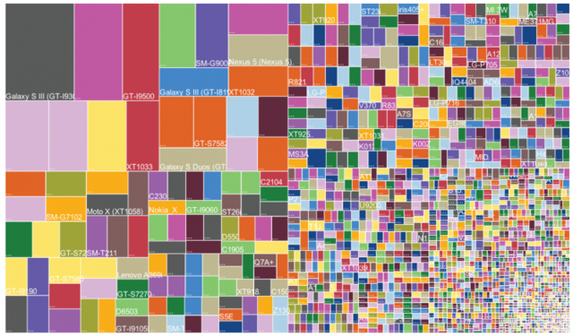
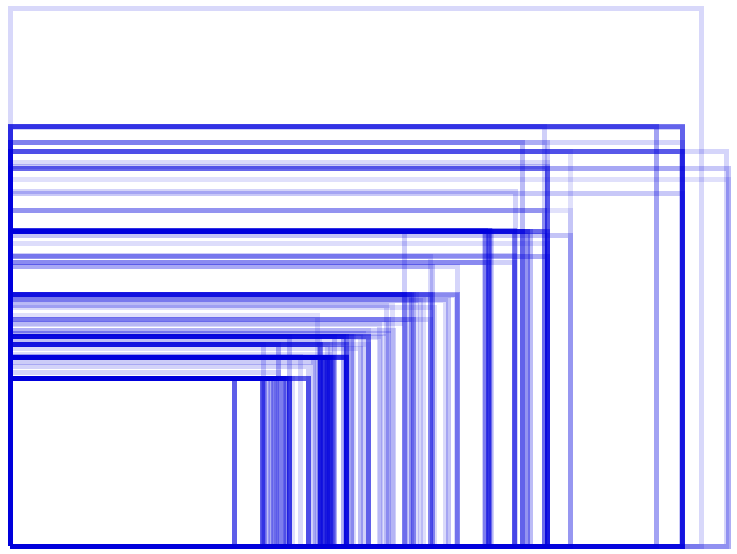
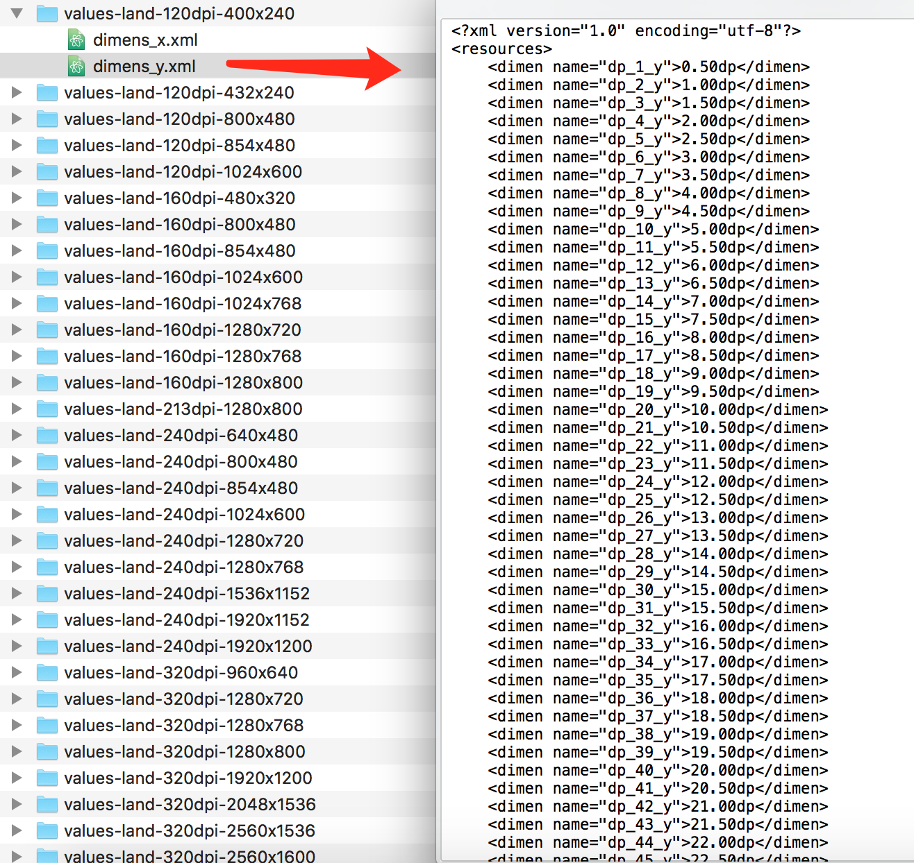
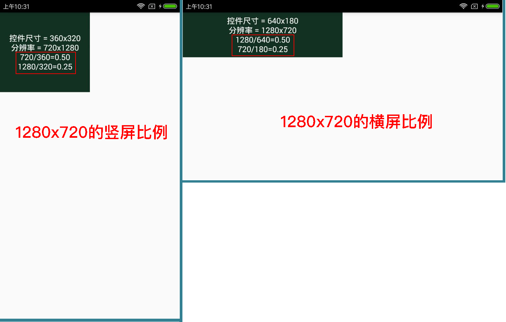
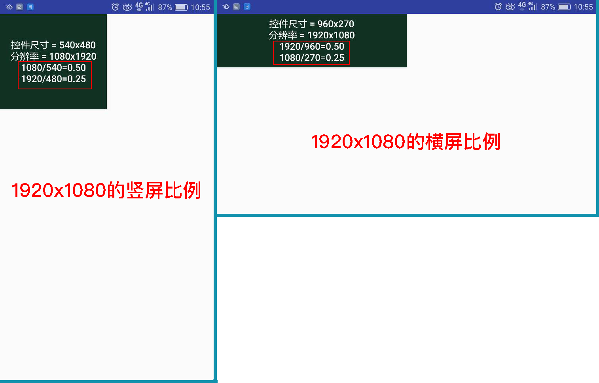

# UIAdapter

### `转载标明出处 `
 
这是一篇关于Android屏幕适配的介绍，首先声明，不建议使用px作为单位，原因大家都知道。 
###图片镇楼  


   
看到这两张图相信大家都不陌生了，没错，这就是苦逼的适配，在2012年，OpenSignalMaps发布了第一份Android碎片化报告，统计数据表明，  
　　2012年，支持Android的设备共有3997种。  
　　2013年，支持Android的设备共有11868种。  
　　2014年，支持Android的设备共有18796种。  
　　···  
　　2017年...？  
***
首先需要介绍一些概念：  
　　[原文地址](http://blog.csdn.net/ttkatrina/article/details/50623043)  

* px(pixels)像素，屏幕上的点，不同设备显示效果相同，例如，HVGA代表320×480像素。
* in(英寸)屏幕的物理尺寸, 每英寸等于2.54厘米。 
* pt(point)标准长度单位， 1pt＝1/72英寸，用于印刷业，UI设计师会用，iOS字体单位，Android开发不涉及。
* dpi(dots per inch) 打印分辨率，每英寸所能打印的点数，即打印精度; 每英寸点数，即每英寸包含像素个数。
* ppi (pixels per inch)图像分辨率, 像素密度，在图像中, 每英寸所包含的像素数目。
* density(屏幕密度), density和dpi的关系为 density = dpi/160。density这个概念方便理解不同dpi的倍数关系。
* dp(也即dip,device independent pixels)设备独立像素，Android特有的单位，与密度无关的像素，基于屏幕密度的抽象单位，在320x480分辨率，同时每英寸160点(dpi = 160)的显示器上，1dp = 1px。
* sp(scaled pixels)放大像素，与刻度无关的像素，字体单位，可以根据用户的字体大小首选项进行缩放。sp和dp一样，是android开发里特有的单位, 查看TextView的源码可知 Android 默认使用 sp 作为字号单位。
为什么要把sp和dp代替px？最简单的原因是他们不会因为ppi的变化而变化，在相同物理尺寸和不同ppi/dpi下，他们呈现的高度大小是相同。也就是说更接近物理呈现，而px则不行。  

换算关系：  
　　px = dp * (dpi / 160)，原来这里的dpi是归一化后的dpi。   
　　则dp = px / (ppi / 160)   
　　ppi = √（长度像素数² + 宽度像素数²） / 屏幕对角线英寸数   
　　dp*ppi/160 = px。比如1dp x 320ppi/160 = 2px。  
***
### gradle:
```groovy
dependencies {
    ...
    implementation 'com.github.sing1:UIAdapter:last_version'
}
```
或者使用后面的代码自己生成，然后考到项目中，或者下载library中的代码拷贝，这个库适配的机型有：  


240x320 120dpi|240x400 120dpi|240x432 120dpi|320x480 160dpi|480x640 240dpi
--------------|--------------|--------------|--------------|--------------  
480x800 120dpi|480x800 160dpi|480x800 240dpi|480x854 120dpi|480x854 160dpi
480x854 240dpi|640x960 320dpi|600x1024 160dpi|600x1024 240dpi|600x1024 120dpi
720x1280 160dpi|720x1280 240dpi|720x1280 320dpi|768x1280 320dpi|768x1024 160dpi
768x1280 160dpi|768x1280 240dpi|800x1280 320dpi|800x1280 160dpi|800x1280 213dpi
1080x1920 420dpi|1080x1920 480dpi|1200x1920 320dpi|1440x2560 560dpi|1152x1536 240dpi
1152x1920 240dpi|1200x1920 240dpi|1536x2048 320dpi|1536x2560 320dpi|1600x2560 320dpi
1080x2400 440dpi|1080x2252 440dpi|1080x2296 440dpi| | 

这个其中包括了横屏和竖屏，下面是生成文件的代码：

```JAVA
// 竖屏文件的输出路劲
private final static String rootPathPort = "/Users/Sing/Desktop/res/values-port-{0}dpi-{1}x{2}/";
// 横屏文件的输出路劲
private final static String rootPathLand = "/Users/Sing/Desktop/res/values-land-{0}dpi-{1}x{2}/";
// 水平方向（X）的值
private final static String templateX = "    <dimen name=\"dp_{0}_x\">{1}dp</dimen>\n";
// 垂直方向（Y）的值
private final static String templateY = "    <dimen name=\"dp_{0}_y\">{1}dp</dimen>\n";
// 默认模板信息，及参照尺寸，这里用的是1280x720 320dpi
private static int defaultDpi = 320;
private static int defaultWidth = 720;
private static int defaultHeight = 1280;
private static double defaultScale = 2.0;

// 将double类型的数据保留两位小数
public static String twoDemal(double num) {
	DecimalFormat dFormat = new DecimalFormat("##0.00");
	String result = dFormat.format(num);
	return result;
}

// 传入宽、高、DPI生成
public static void makeString(int w, int h, int dpi) {
	makeValue(w,h,dpi,0);// 竖屏X
	makeValue(w,h,dpi,1);// 竖屏Y
	makeValue(w,h,dpi,2);// 横屏X
	makeValue(w,h,dpi,3);// 横屏Y 
}

// type 0-3 分别为 竖屏X、竖屏Y、横屏X、横屏Y
private static void makeValue(int w, int h, int dpi, int type) {
	double scale = ((double) dpi / 160); // 缩放比例
	double totalWidthDp = defaultWidth / defaultScale; // 机型水平方向总共有多少个DP
	double totalHeightDp = defaultHeight / defaultScale; // 机型垂直方向总共有多少个DP
 
	double portWidthValue = (double) w / scale / totalWidthDp; // 竖屏情况下，参考模板水平方向(X) 每1dp对应的适配机型的值
	double portHeightValue = (double) h / scale / totalHeightDp;// 竖屏情况下，参考模板垂直方向(Y) 每1dp对应的适配机型的值
	double landWidthValue = ((double) h / w) * portWidthValue;// 横屏情况下，参考模板水平方向(X) 每1dp对应的适配机型的值
	double landHeightValue = ((double) w / h) * portHeightValue;// 横屏情况下，参考模板垂直方向(Y) 每1dp对应的适配机型的值

	String rootPath = "";// 实际输出的路径
	File layFile = null;
	String fileName = "";
		
	StringBuffer sb = new StringBuffer();
	sb.append("<?xml version=\"1.0\" encoding=\"utf-8\"?>\n");// 文件头
	sb.append("<resources>\n");// 文件头

	if (type == 0) { // 竖屏 X
		for (int i = 1; i <= 200; i++) {
			sb.append(templateX.replace("{0}", i + "").replace("{1}", twoDemal(portWidthValue * i) + ""));
		}
		rootPath = rootPathPort;
		fileName = "dimens_x.xml";
	} else if (type == 1) {// 竖屏 Y
		for (int i = 1; i <= 200; i++) {
			sb.append(templateY.replace("{0}", i + "").replace("{1}", twoDemal(portHeightValue * i) + ""));
		}
		rootPath = rootPathPort;
		fileName = "dimens_y.xml";
	} else if (type == 2) {// 横屏 X
		for (int i = 1; i <= 200; i++) {
			sb.append(templateX.replace("{0}", i + "").replace("{1}", twoDemal(landWidthValue * i) + ""));
		}
		fileName = "dimens_x.xml";
		rootPath = rootPathLand;
	} else if (type == 3) {// 横屏 Y
		for (int i = 1; i <= 200; i++) {
			sb.append(templateY.replace("{0}", i + "").replace("{1}", twoDemal(landHeightValue * i) + ""));
		} 
		rootPath = rootPathLand;
		fileName = "dimens_y.xml";
	}
	sb.append("</resources>");// 文件尾

	String path = rootPath.replace("{0}", dpi + "").replace("{1}", h + "").replace("{2}", w + "");
	File rootFile = new File(path);
	if (!rootFile.exists()) {
		rootFile.mkdirs();
	}
	layFile = new File(path + fileName);
	try {
		PrintWriter pw = new PrintWriter(new FileOutputStream(layFile));
		pw.print(sb.toString());
		pw.close();
	} catch (FileNotFoundException e) {
		e.printStackTrace();
	}
}   

// 入口在这里，想生成什么机型就传入什么机型的信息，
public static void main(String[] args) {
	makeString(720, 1280, 320);
	makeString(1080, 1920, 480);
	// 这里可以输出你想要适配的机型
}
```
传入相应的机型后输出效果图如下：



使用生成的代码进行适配：  


  

从图中可以看出，在1280x720和1920x1080的手机上，不管是横屏还是竖屏，控件的宽度和高度分别占据屏幕的1/2和1/4的的大小，由此说明，生成的文件计算的还是准确的，但是竖屏是个接近正方形的在横屏上却变成了长方形，是哪里出问题了？

```xml
<?xml version="1.0" encoding="utf-8"?>
<LinearLayout xmlns:android="http://schemas.android.com/apk/res/android"
    android:layout_width="match_parent"
    android:layout_height="match_parent"
    android:orientation="vertical">

    <Button
        android:id="@+id/button"
        android:layout_width="@dimen/dp_180_x"
        android:layout_height="@dimen/dp_160_y"
        android:background="#123123"
        android:textAllCaps="false"
        android:textColor="@android:color/white"
        android:textSize="16sp" />

</LinearLayout>
```

是因为控件的长度和高度是按手机的长宽计算的，所以适配的时候有时高度需要按照宽度来作为参考物，这个需要了解一下。
***
这个是第一版，如果有BUG的话欢迎指出！
